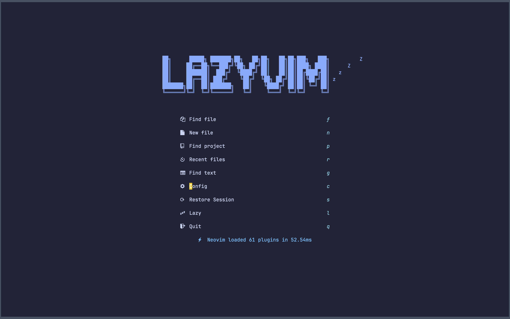

<h1 align="center">Welcome to nvim-for-webdev 👋</h1>

<p>
Are you a web developer working with JS, Typescript, React, and Tailwind CSS? Check out the Neovim and LazyVim plugin starter template!
</p>

[![IT Man - Talk #33 NeoVim as IDE [Vietnamese]](https://i.ytimg.com/vi/dFi8CzvqkNE/hqdefault.jpg)](https://www.youtube.com/watch?v=dFi8CzvqkNE)

[](https://www.youtube.com/watch?v=3EbgMJ-RcWY)

## Starter Template for Web Developers

**[Note:]** This Neovim configuration is based on the starter template at
https://github.com/jellydn/nvim-for-webdev and is extensively enhanced for
use with [Lazyman](https://github.com/doctorfree/nvim-lazyman).

This is a starter template for [LazyVim](https://github.com/LazyVim/LazyVim).
Refer to the [documentation](https://lazyvim.github.io/installation) to get started.

Find detailed resources for each plugin in the accompanying readme. Start your web development journey with Neovim and LazyVim today!

## Install Lazyman

```bash
git clone https://github.com/doctorfree/nvim-lazyman $HOME/.config/nvim-Lazyman
$HOME/.config/nvim-Lazyman/lazyman.sh
```

## Install the Webdev Neovim configuration

```bash
lazyman -w Webdev
```

## Configure the shell environment

```bash
export NVIM_APPNAME="nvim-Webdev"
alias wvim="NVIM_APPNAME=nvim-Webdev nvim"
```

## [Keymaps](./lua/config/keymaps.lua)

- Add custom mappings for quickly exiting insert mode, closing buffers, opening the Alpha dashboard, displaying NullLs info, and toggling certain features of the Gitsigns and Todo Comments plugins.

## UI

### Dashboard



### Folding

- Add [UFO folding and hover to preview](./lua/plugins/2-folding.lua)

## Setup [IDE](./lua/plugins/1-coding.lua)

This IDE setup includes several plugins for Neovim that provide features such as autocompletion, documentation generation, and formatting. The setup includes the Codeium plugin, which is a competitor to GitHub Copilot, as well as the Tabnine autocompletion plugin. Additionally, the setup includes the vim-jsdoc plugin for generating documentation, and plugins for sorting Tailwind CSS classes using Rustywind and null-ls.nvim.

### Resources

- https://codeium.com/compare/comparison-copilot-codeium
- https://github.com/Exafunction/codeium.vim
- https://www.tabnine.com/blog/tabnine-vs-github-copilot/
- https://github.com/tzachar/tabnine-vim
- https://github.com/codota/tabnine-nvim
- https://github.com/heavenshell/vim-jsdoc
- https://github.com/avencera/rustywind

### Tutorial
- [LazyVim: Linting and Formatting](https://www.youtube.com/watch?v=a_ZpTPaSn38)
- [LazyVim: Tailwind CSS Support](https://www.youtube.com/watch?v=_NiWhZeR-MY)

[![IT Man - Tip #38 - Learning Vim with VSCode - A Comprehensive Guide [Vietnamese]](https://i.ytimg.com/vi/yTTPRm0ACl0/hqdefault.jpg)](https://www.youtube.com/watch?v=yTTPRm0ACl0)


## Authors

👤 **Ronald Joe Record**

- Website: https://ronrecord.com/
- Twitter: [@ronrecord](https://twitter.com/ronrecord)
- Github: [@doctorfree](https://github.com/doctorfree)

👤 **Huynh Duc Dung**

- Website: https://productsway.com/
- Twitter: [@jellydn](https://twitter.com/jellydn)
- Github: [@jellydn](https://github.com/jellydn)

## Show your support

Give a ⭐️ if this project helped you!

[](https://paypal.me/ronrecord)
[](https://www.buymeacoffee.com/doctorfree)
